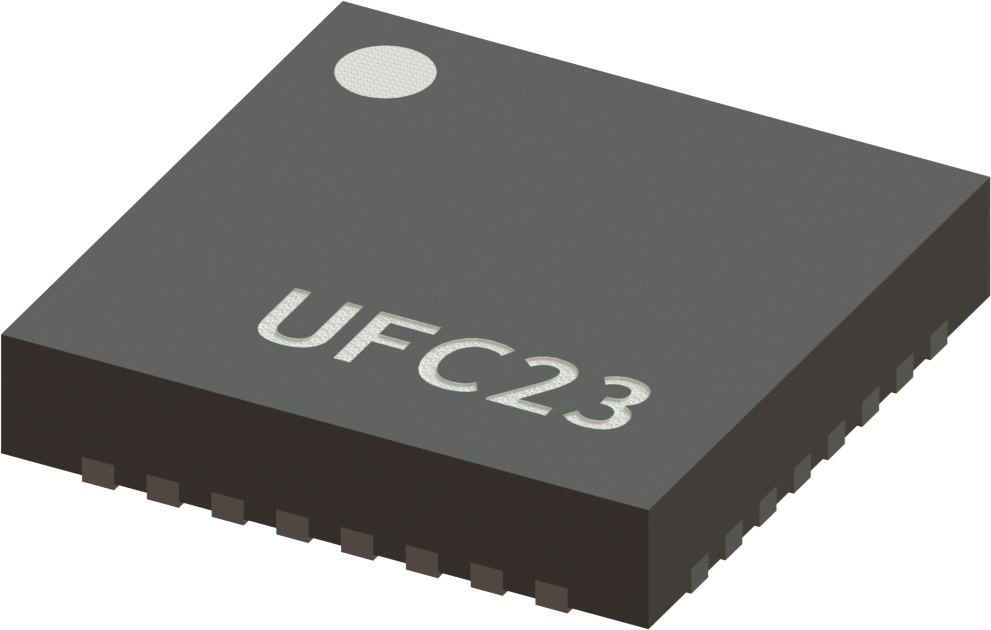
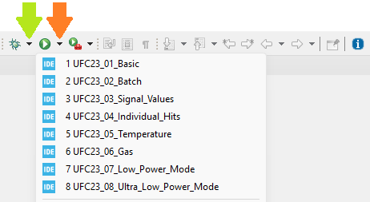

# STM32 project examples for ScioSense UFC23 and UFC18 ultrasound sensors
The UFCxx sensor family from [ScioSense](https://www.sciosense.com/) offers ultrasonic flow converters for measurements in water, heat and gas meters. The sensors come in the size QFN32 package with digital SPI interface. It uses an high-performance front-end capable of driving two transducers and processing the received signal to extract the time of flight (TOF) information with high precision and offset stability.

A 128-words RAM allows access to all time data but also accumulation of data (batch mode) and reduced wake-up of external µC. With 1µA quiescent current and low operation current it is optimized for battery-operated systems.

## Prerequisites
It is assumed that
 - The STM32CubeIDE has been installed. If not, refer to "Install the STM32CubeIDE" on the [ST site](https://www.st.com/en/development-tools/stm32cubeide.html#overview).
 - The STM32CubeMX has been installed. If not, refer to "Install the STM32CubeMX" on the [ST site](https://www.st.com/en/development-tools/stm32cubemx.html).
 - The STM32CubeProgrammer could been installed, optionally. If not, refer to "Install the STM32CubeProgrammer" on the [ST site](https://www.st.com/en/development-tools/stm32cubeprog.html).
 - The STM32CubeMonitor could been installed, optionally. If not, refer to "Install the STM32CubeMonitor" on the [ST site](https://www.st.com/en/development-tools/stm32cubemonitor.html).
   
You might need to add your board to the STM32CubeIDE. This library was prepared for the [STM32 Nucleo-64 development board with STM32U385RG MCU](https://www.st.com/en/evaluation-tools/nucleo-u385rg-q.html). The library uses function definitions that are for the U385RG core, and the pin function definitions are configured for the nucleo board in combination with the ScioSense shield.
For the installation of the STM32U385RG in the STM32CubeIDE, see [STM32U385RG Installation](https://www.st.com/en/development-tools/stm32cubemx.html#documentation).

## Installation

### Manual installation
- Download the code from this repository via "Download ZIP".
- In STM32CubeIDE, select Import > General > Existing Projects into Workspace... and browse to the just unpacked ZIP file.
- When the IDE is ready this README.md should be located in your workspace.

## Wiring

### General
THE UFC ST shield is made to fit directly on the Arduino connectors of the Nucleo board. 

:warning: Please check that the jumper is on the ST position.

### Ultrasonic connections
For all examples except **06_Gas**, the transducer is connected in single ended mode. That means that the leads of the upstream transducer must be connected to XL_UP and to GNDP, and the leads of the downstream transducer to XL_DN and to GNDP.

For the **06_Gas** example the connection is differential. This requires the leads of the upstream transducer to be connected to XH_UP and XL_UP, and the leads of the downstream transducer to XH_DN and to XL_DN.

### Ultra low power wiring
For the **08_Ultra_Low_Power** example, a jumper wire connection must be established between the UFC23 INT pin (PC7 on the U385) and the Wake_Up_Pin_6 (PB5 on the U385)

## Running the code

### Selecting an example
The project has several examples:
- **01_Basic**
  - Single ended connection (transducer connected between XL and GNDP)
  - Reads single ultrasonic measurement
  - Reports
    - Average multihit ToF sum upstream and downstream
    - Difference in ToF 
- **02_Batch**
  - Single ended connection (transducer connected between XL and GNDP)
  - Reads a batch of 12 ultrasonic measurements at a time
  - Reports
    - Batch and bundle number
    - Average multihit ToF sum upstream and downstream
    - Difference in ToF
    - ToF difference mean and standard deviation
- **03_Signal_Values**
  - Single ended connection (transducer connected between XL and GNDP)
  - On start reads VCC, VDD, and performs a spool check
  - Reads single ultrasonic measurement
  - Reports
    - Amount of hits detected
    - Zero cross level
    - Amplitude of the first three hits
    - Pulse width ratios
- **04_Individual_Hits**
  - Single ended connection (transducer connected between XL and GNDP)
  - Reads single ultrasonic measurement
  - Reports
    - Average multihit ToF sum upstream and downstream
    - Difference in ToF 
    - All the recorded individual hits
- **05_Temperature**
  - Single ended connection (transducer connected between XL and GNDP)
  - Reads single ultrasonic measurement and two PT1000 sensors
  - Reports
    - ToF difference mean and standard deviation
    - Temperature in ports 1 and 2
- **06_Gas**
  - Differential connection (transducer connected between XL and XH)
  - Reads single ultrasonic measurement
  - Reports
    - Average multihit ToF sum upstream and downstream
    - Difference in ToF
- **07_Low_Power_Mode**
  - Single ended connection (transducer connected between XL and GNDP)
  - Not compatible with debug mode
  - Reads a batch of 12 ultrasonic measurements at a time
  - Goes into deep sleep after measurement
  - Woken up by interrupt from device
  - Reports
    - Batch and bundle number
    - Average multihit ToF sum upstream and downstream
    - Difference in ToF
    - ToF difference mean and standard deviation
- **08_Ultra_Low_Power_Mode**
  - Single ended connection (transducer connected between XL and GNDP)
  - Not compatible with debug mode
  - Requires the INT to be connected to WakeUp6, as detailed in [Wiring](#ultra-low-power-wiring)
  - Reads a batch of 12 ultrasonic measurements at a time
  - Goes into shutdown mode after a measurement
    - RAM contents are deleted
  - On wake up (equivalent to reset) it checks if the device is measuring
    - If it is, collect the latest measurement
    - If it is not, configure the device and start the measurements
  - Reports
    - Bundle number
    - Average multihit ToF sum upstream and downstream
    - Difference in ToF

There is one Build configuration for each example.

The main.c file (in _/Core/Src/_) imports the UFC23_Example_Setup() and UFC23_Example_Loop() functions from the specified example on the Build configuration. The examples are in _/Core/Src/ScioSense_, while the UFC23 library is in  _/Core/Src/ScioSense/src_.

:information_source: Examples 07_Low_Power_Mode and 08_Ultra_Low_Power_Mode cannot run in debug mode. This is because the debug interferes with the low power modes and wake up conditions.

The Build configuration to use for running or debugging the code on the STM32 nucleo can be selected by pressing the selector arrow next to the debug or run button:

## Selecting a sensor configuration
The examples set the UFC23 configuration by setting the contents of the registers. This is done feeding an array with the register contents into the _ufc23.setConfigurationRegisters()_ function. It is also possible to edit the individual parameters under _ufc23.Param_. After modifying the parameters this way, the _ufc23.updateConfiguration()_ function must be called to update the data structures to these new settings.

The configuration is only written to the device when the function _ufc23.writeConfig()_ is called.

### Transducer
The examples contains a configuration that is ready to be used with the [Audiowell ultrasound transducer HS0014-007](https://www.audiowell.com/flowsensorwithpipe/80.html). The configuration must be adapted for your specific transducer.

The following registers must be reviewed in particular:
- CR_USM_PROC (Ultrasonic processing) (Address 0xAA)
  - C_USM_MASK_WIN: Mask window, depends on the the length of the transducer
- CR_USM_FBG_MCTRL (Fire burst generator control) (Address 0xAB)
  - C_FBG_LR_CLK_DIV: Divider to select a fire frequency that coincides with the resonance of the transducer
- CR_USM_ANA_CTRL2 (analog control) (Address 0xAE)
  - C_RMSET_TX: resistance of the transducer
  - C_RMSET_RX: resistance of the transducer
  - C_PGA_ST1_GAIN: gain of first PGA stage. If more amplification is needed consider using differential mode and the second PGA stage
- CR_USM_HIT_CTRL (Ultrasonic hit control) (Address 0xB0)
  - C_TOF_MULTIHIT_NO: Number of hits to fire. The firing of pulses should be completed before the echoes arrive back to the firing transducer
- CR_USM_MASK_HR_WIN (High resolution receiver mask in up direction) (Address 0xB2)
  - C_USM_MASK_HR_WIN_DN: can be used to fine tune the mask window
  - C_USM_MASK_HR_WIN_UP: can be used to fine tune the mask window